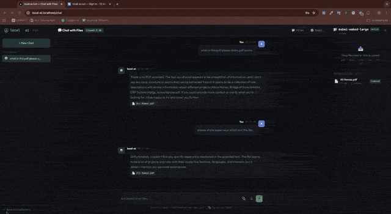

<div align="center">

# local-ai.run

**Self-hosted AI platform. Chat with files, switch model engines, fully offline. Your data never leaves your machine.**

[](./LICENSE)
[](https://docs.docker.com/get-docker/)
[](https://discord.gg/vndd7TzhVU)
[](https://github.com/360solutions-dev/local-ai)

</div>

## Install

```bash
curl -fsSL https://get.local-ai.run/install.sh | bash
```

That's it. The installer detects Docker, pulls the pre-built images, prompts for a free port if 80 is taken, and brings everything up. Then open `http://local-ai.localhost` in your browser.

> Requires Docker Desktop (Mac/Windows) or Docker Engine (Linux). 8 GB RAM minimum, 16 GB recommended for larger models.

<p align="center">
  
</p>

## What It Is

A complete local AI workspace that runs in Docker on your own hardware:

- **Chat with your files** — drop PDFs, DOCX, XLSX, CSV, TXT, MD; ask questions; get answers with citations (RAG)
- **Multiple model engines** — Ollama out of the box, with support for LM Studio, vLLM, llama.cpp endpoints
- **Speech-to-text** — Whisper running locally, no API calls
- **Air-gappable** — bundle the install with `docker save` tarballs and run with zero network access
- **Single-user optimized** — no complex auth, no SaaS, no telemetry, no analytics
- **One-command updates** — built-in updater pulls new versions from Docker Hub and restarts cleanly

## Why It Exists

Cloud AI services route your conversations and uploaded files through third-party infrastructure. For privacy-sensitive work (legal documents, medical records, internal company data, compliance-bound industries), that's a non-starter.

`local-ai.run` gives you the same experience as a hosted chat tool, but every byte stays on your machine:

- No outbound API calls during chat or document processing
- No cloud LLM dependency (Ollama, llama.cpp, vLLM, LM Studio — your choice)
- No vendor lock-in (MIT licensed, plain Docker Compose, swap any component)
- Built-in update system pulls signed images from Docker Hub on your schedule

## Architecture

```
┌──────────┐      ┌────────────┐      ┌─────────────┐
│ Next.js  │ ───▶ │   Django   │ ───▶ │  PostgreSQL │
│   UI     │      │  REST API  │      └─────────────┘
└──────────┘      └────────────┘
                        │
                        ├──▶ Ollama (LLM inference)
                        ├──▶ RAG service (FastAPI + vector store)
                        └──▶ Whisper (speech-to-text)

       All services routed through Caddy reverse proxy on port 80.
```

Six containers, one Docker network, zero external dependencies after install.

## Clone & Run From Source

Building from a clone (for development or to customize images) needs a couple of
extra choices the one-liner makes for you — mainly **where Ollama runs** (your
machine vs. a bundled container) and the `.env` secrets. The `setup.sh` /
`setup.ps1` script handles all of that interactively.

> [!IMPORTANT]
> **macOS:** clone into your **home directory**, not `~/Documents`, `~/Desktop`,
> or `~/Downloads`. macOS privacy (TCC) blocks Docker Desktop from bind-mounting
> folders under those paths, which fails with
> `mkdir /host_mnt/...: operation not permitted`. Either move the project out of
> those folders, or grant Docker Desktop **Full Disk Access** in
> *System Settings → Privacy & Security* and add the path under
> *Docker Desktop → Settings → Resources → File Sharing*.

### Quick clone + setup (recommended)

```bash
git clone https://github.com/360solutions-dev/local-ai.git
cd local-ai
```

| Platform | Setup | Uninstall |
|---|---|---|
| macOS (Intel & Apple Silicon / M1) | `./setup.sh` | `./uninstall.sh` |
| Ubuntu / Linux | `./setup.sh` | `./uninstall.sh` |
| Windows | `powershell -ExecutionPolicy Bypass -File .\setup.ps1` | `powershell -ExecutionPolicy Bypass -File .\uninstall.ps1` |

The setup script:

1. Verifies Docker / Compose, then creates `.env` from `.env.example` and
   auto-generates the secrets (`DJANGO_SECRET_KEY`, `RAG_API_KEY`, etc.).
2. **Asks where Ollama should run — Machine or Docker:**
   - **Machine** — installs host Ollama if missing (Homebrew on macOS,
     official installer on Linux, winget/installer on Windows), starts it, and
     pulls `llama3.1:8b` + `nomic-embed-text`.
   - **Docker** — uses the bundled `container-ollama` profile, nothing to install.
3. Writes the matching `OLLAMA_HOST` / `COMPOSE_PROFILES` into `.env` and runs
   `docker compose up -d`.

**Uninstall flags** — `--remove-ollama` (also remove host Ollama + `~/.ollama`
models), `--keep-volumes` (keep your data), `--remove-env`, `--yes`. On Windows:
`-RemoveOllama`, `-KeepVolumes`, `-RemoveEnv`, `-Yes`.

Prefer to run each step by hand instead of the script? See
[Manual install (Docker Compose) →](https://docs.local-ai.run/getting-started#manual-install)
for the full step-by-step (env, migrations, model pull, hosts entry).

## Configuration

All settings live in `.env`. Key variables:

| Variable | Default | Purpose |
|---|---|---|
| `APP_PORT` | `80` | Host port for the web UI (Caddy) — auto-detected if 80 is busy |
| `LOCAL_AI_IMAGE_TAG` | latest release | Pinned image version (e.g. `1.0.0`) |
| `WHISPER_MODEL` | `base` | Whisper model size: `tiny`, `base`, `small`, plus `.en` variants |
| `COMPOSE_PROFILES` | `container-ollama` | Set blank to use host Ollama instead of bundled |
| `OLLAMA_HOST` | `http://ollama:11434` | Point to host or remote Ollama if not using bundled |

Full reference: [Configuration docs →](https://docs.local-ai.run/configuration)

## Updating

In-app: **Settings → Advanced → Check for Updates → Install Update.**

Or manually:

```bash
docker compose -f docker-compose.release.yml pull
docker compose -f docker-compose.release.yml up -d
```

## What's in the Stack

| Service | Tech | Role |
|---|---|---|
| `caddy` | Caddy 2 | Reverse proxy on port 80, routes by hostname |
| `nextjs` | Next.js 16 | Web UI |
| `django` | Django + DRF + Gunicorn | REST API, auth, JWT cookies |
| `rag` | FastAPI + Python | RAG indexing and query |
| `whisper` | faster-whisper | Speech-to-text |
| `ollama` | Ollama | LLM inference (optional — host Ollama also supported) |
| `postgres` | Postgres 16 alpine | Data store |
| `updater` | Python stdlib | Check + apply updates from Docker Hub |

## Roadmap

See the [public project board](https://github.com/360solutions-dev/local-ai/projects).

Planned for next releases:
- Image generation (Stable Diffusion via local backend)
- Document summarizer
- Semantic search across all indexed files
- Plugin system for custom model providers

## Air-Gapped / Offline Install

For environments with no internet access:

1. On a machine with internet, run: `docker save <image>... > images.tar`
2. Copy `images.tar` and the repo to the target machine
3. Run `./install.sh --offline`

Full guide: [OFFLINE_INSTALL.md](./OFFLINE_INSTALL.md)

## Community & Support

- **Discord** — Live chat, install help, feature discussions: [Join](https://discord.gg/vndd7TzhVU)
- **GitHub Discussions** — Long-form Q&A and ideas
- **GitHub Issues** — Bug reports and feature requests (use the templates)
- **Docs** — [docs.local-ai.run](https://docs.local-ai.run)

## Contributing

PRs welcome. See [CONTRIBUTING.md](./CONTRIBUTING.md) for setup, code style, and the PR workflow.

Quick start for contributors:

```bash
git clone https://github.com/360solutions-dev/local-ai.git
cd local-ai
./setup.sh          # sets up .env, Ollama, and starts the stack
# Edit code in frontend/ or backend/ — hot reload is on
```

## License

MIT. See [LICENSE](./LICENSE).

---

<div align="center">

Made by people who got tired of mailing PDFs to OpenAI.

[Website](https://local-ai.run) · [Docs](https://docs.local-ai.run) · [Discord](https://discord.gg/vndd7TzhVU) · [GitHub](https://github.com/360solutions-dev/local-ai)

</div>
